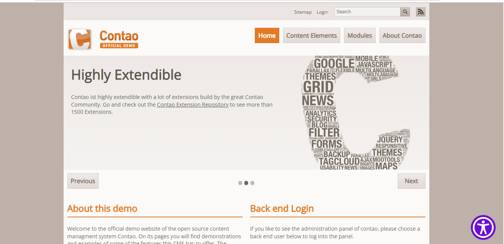

# All in One Accessibility extension for Contao Open Source CMS.

All in One Accessibility is an extension for the [Contao Open Source CMS](https://contao.org).

All in One Accessibility widget improves Contao website ADA compliance and browser experience for ADA, WCAG 2.1 & 2.2, Section 508, Australian DDA, European EAA EN 301 549, UK Equality Act (EA), Israeli Standard 5568, California Unruh, Ontario AODA, Canada ACA, German BITV, France RGAA, Brazilian Inclusion Law (LBI 13.146/2015), Spain UNE 139803:2012, JIS X 8341 (Japan), Italian Stanca Act and Switzerland DDA Standards.

It uses the accessibility interface which handles UI and design related adjustments. All in One Accessibility app enhances your Contao website accessibility to people with hearing or vision impairments, motor impaired, color blind, dyslexia, cognitive & learning impairments, seizure and epileptic, and ADHD problems.

System requirements
-------------------

* [Contao 4.9](https://github.com/contao/contao) or higher

Installation & Configuration
----------------------------

1. Search for "All in One Accessibility" in Contao Manager or use command line.

    composer require skynettechnologies/contao-allinoneaccessibility

2. Go to Admin pannel -> Pages/Site structure  Now You can see All in One Accessibility Setting. Check "Enable allinoneaccessibility" and Save.

3. Check your website.

## Documentation

[Read the documentation](docs/README.md)

## Copyright

This project has been created and is maintained by [Skynet Technologies USA LLC](https://www.skynettechnologies.com/).
