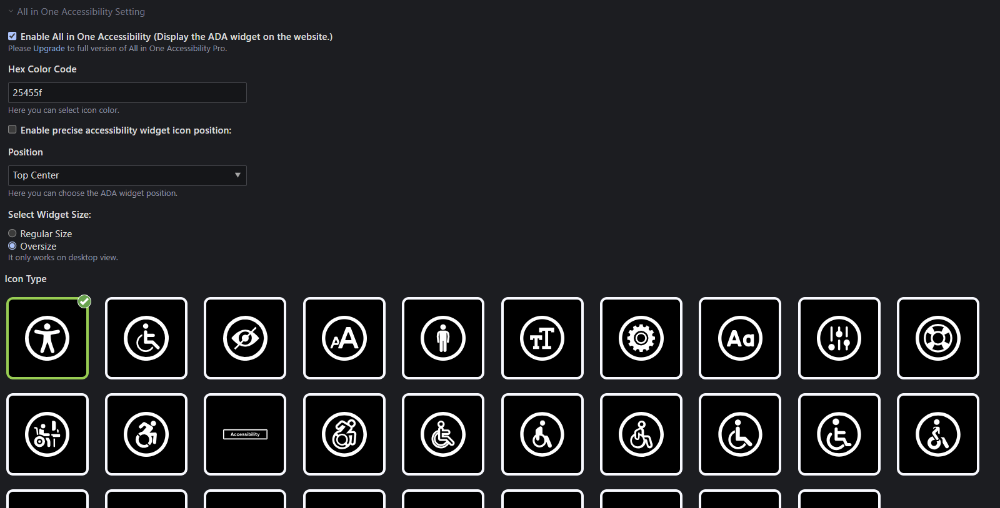
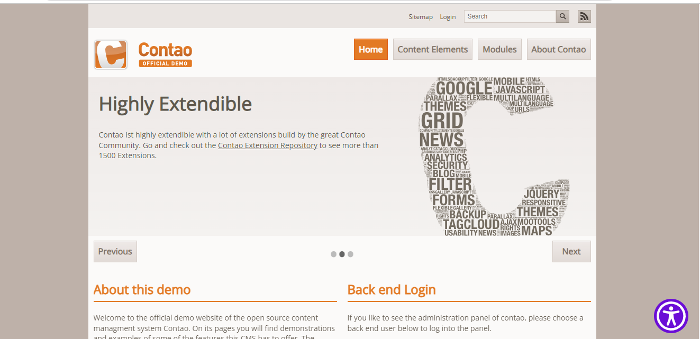

# Allinoneaccessibility – Documentation

## Configuration

The allinoneaccessibility is configured per each website root. To enable it, go to the Site structure and edit the desired root page.

Additionally,
you can also choose color,postion that will appear in root page.

The widget will then appear in the front end. Please note that you **do not need** any JavaScript library like MooTools or
jQuery to make it work.

## Change appearance

The allinoneaccessibility can be easily styled using CSS:

## Troubleshooting

If your allinoneaccessibility is not displayed it may be related to the fact that you use the XHTML page layout. The extension
does not provide XHTML support out of the box. To fix this problem, you may need need to create the `allinoneaccessibility.xhtml`
template based on the genuine `allinoneaccessibility.html5`.
